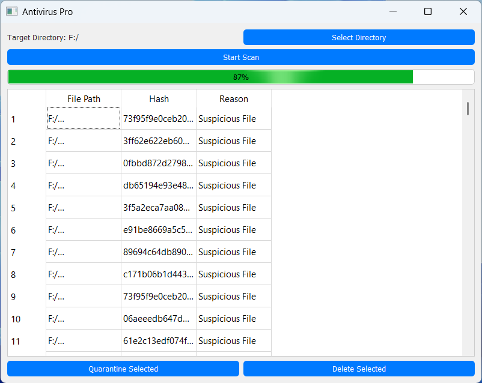

# Antivirus Pro

Antivirus Pro is a lightweight, multi-threaded desktop antivirus scanner with a sleek Apple iOS-like interface. It scans directories for known malware signatures and suspicious files based on file types and heuristics, allowing users to quarantine or delete threats easily.

---

---
## Features

- ✅ Signature-based malware detection (using file hashes)
- 🚨 Heuristic analysis (e.g., suspicious file extensions, temp directories)
- ⚙️ Multi-threaded scanning for faster performance
- 📁 Quarantine system to isolate detected threats
- 🗑️ Option to delete suspicious/malicious files
- 📊 Real-time progress display and results table
- 💡 Apple iOS-like modern UI using PyQt5

## Requirements

- Python 3.8+
- PyQt5

Install dependencies with:

```bash 
pip install -r requirements.txt

